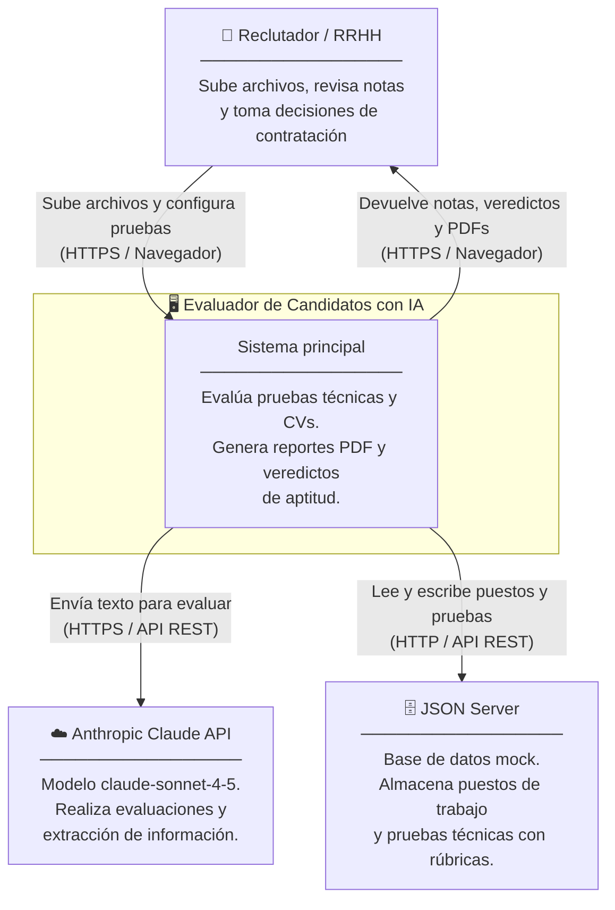

# C4 Nivel 1 — Contexto del Sistema

> **¿Quién usa el sistema? ¿Con qué sistemas externos interactúa?**

---

## Diagrama de contexto

---

## Actores

### Reclutador / Analista de RRHH
- **Perfil:** No requiere conocimientos técnicos para usar el sistema.
- **Acciones principales:**
  1. Configurar puestos de trabajo y pruebas técnicas (panel admin).
  2. Subir el CV del candidato y obtener su nota de ajuste al perfil.
  3. Subir la entrega técnica del candidato (código, ZIP, PDF, notebook) y obtener su nota.
  4. Solicitar el análisis combinado de aptitud (veredicto final).
  5. Descargar los reportes en PDF para archivar o compartir.
  6. Realizar evaluaciones masivas subiendo ZIPs con archivos de varios candidatos.

---

## Sistemas externos

### Anthropic Claude API
| Atributo | Valor |
|----------|-------|
| Modelo predeterminado | `claude-sonnet-4-5` (configurable via `AI_MODEL`) |
| Protocolo | HTTPS / REST |
| Autenticación | `ANTHROPIC_API_KEY` en `.env` |
| Timeout | 300 segundos (configurable via `AI_TIMEOUT`) |
| Uso | Evaluación de código, CVs, documentos escritos, notebooks, escaneo de documentos admin |

> **Importante:** No hay límite de tokens de salida configurado (`max_tokens` no se pasa), lo que permite respuestas completas sin truncar.

### JSON Server
| Atributo | Valor |
|----------|-------|
| Puerto | `3000` (configurable via `JSON_SERVER_URL`) |
| Tipo | Mock REST API sobre archivo `jsonserver/db.json` |
| Protocolo | HTTP / REST |
| Autenticación | Ninguna (entorno local) |
| Recursos | `GET/POST/PUT/PATCH/DELETE /jobs` y `/technicalTests` |

> JSON Server actúa como base de datos durante el desarrollo. En producción se reemplazaría por una base de datos real (PostgreSQL, MySQL, etc.) con los mismos endpoints REST.

---

## Límites del sistema

Lo que el sistema **sí hace:**
- Evaluar cualquier tipo de entrega: código, texto, PDFs, ZIPs, notebooks.
- Generar reportes PDF descargables.
- Tomar decisiones de aptitud basadas en IA + reglas deterministas.
- Evaluar a decenas de candidatos simultáneamente (carga masiva).

Lo que el sistema **no hace:**
- Enviar correos o notificaciones automáticas.
- Gestionar cuentas de usuario o autenticación.
- Almacenar resultados en base de datos (solo en memoria/sesión de navegador).
- Integrarse directamente con ATS (sistemas de seguimiento de candidatos).
