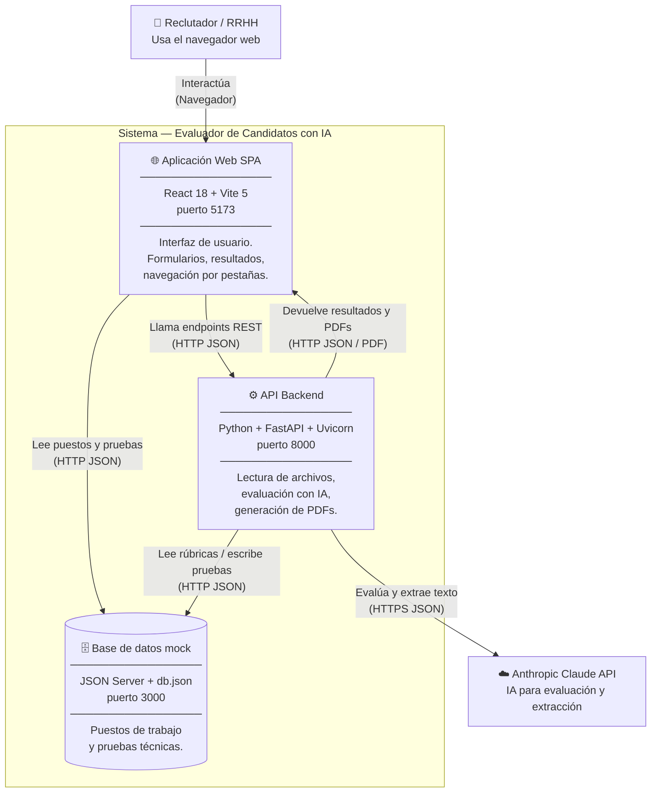

# C4 Nivel 2 — Contenedores

> **¿Cuáles son las aplicaciones que forman el sistema y cómo se comunican?**

---

## Diagrama de contenedores



---

## Contenedor 1: Aplicación Web (SPA)

| Atributo | Valor |
|----------|-------|
| Tecnología | React 18, Vite 5 |
| Puerto | `5173` (dev) |
| Directorio | `front/` |
| Comando de arranque | `npm run dev` (dentro de `front/`) |
| Punto de entrada | `front/src/main.jsx` → `front/src/App.jsx` |

### Responsabilidades
- Mostrar la interfaz de cuatro pestañas: **Evaluación Técnica**, **Evaluación de CV**, **Análisis de Aptitud** y **Administración**.
- Gestionar el estado de la sesión (nombre del candidato, resultados, historial).
- Subir archivos al backend y mostrar los resultados.
- Descargar reportes PDF generados por el backend.
- Comunicarse con **JSON Server** para listar puestos y pruebas, y con el **backend** para todas las evaluaciones.

### Variables de entorno importantes (frontend)
No usa `.env` propio — las URLs del backend están en `front/src/constants.js`:
```js
// front/src/constants.js
export const API_BASE = 'http://localhost:8000'
export const JSON_SERVER_BASE = 'http://localhost:3000'
```
Si cambias el puerto del backend o de JSON Server, edita este archivo.

---

## Contenedor 2: API Backend

| Atributo | Valor |
|----------|-------|
| Tecnología | Python 3.11, FastAPI, Uvicorn |
| Puerto | `8000` |
| Directorio | `back/` |
| Comando de arranque | `uvicorn main:app --reload` (dentro de `back/`, con venv activo) |
| Punto de entrada | `back/main.py` |
| Configuración | `back/.env` (copiar de `back/.env.example`) |

### Responsabilidades
- Exponer todos los endpoints REST usados por el frontend.
- Leer y parsear archivos (PDF, DOCX, TXT, ZIP, IPYNB) recibidos como `multipart/form-data`.
- Construir los prompts y llamar a Claude (Anthropic) para las evaluaciones.
- Generar PDFs con ReportLab.
- Leer rúbricas de JSON Server y escribir nuevas pruebas/puestos escaneados.

### Endpoints principales

| Método | Ruta | Descripción |
|--------|------|-------------|
| `GET`  | `/health` | Estado del servicio y API key configurada |
| `POST` | `/api/evaluate` | Evalúa código pegado en texto |
| `POST` | `/api/evaluate/upload` | Evalúa archivo subido (código, ZIP, PDF, DOCX) |
| `POST` | `/api/evaluate/written` | Evalúa evaluación escrita (PDF/DOCX/TXT) |
| `POST` | `/api/evaluate/notebook` | Evalúa notebook Jupyter/Colab (.ipynb) |
| `POST` | `/api/evaluate/bulk-cv` | Evaluación masiva de CVs desde ZIP |
| `POST` | `/api/evaluate/bulk-test` | Evaluación masiva de pruebas desde ZIP |
| `POST` | `/api/analyze/bulk-combined` | Análisis de aptitud masivo (cruce por nombre) |
| `POST` | `/api/resume/evaluate` | Evalúa CV en texto |
| `POST` | `/api/resume/evaluate/upload` | Evalúa CV desde archivo |
| `POST` | `/api/combined/analyze` | Análisis de aptitud individual |
| `POST` | `/api/admin/scan-test-file` | Escanea documento para crear prueba técnica |
| `POST` | `/api/admin/scan-job-file` | Escanea documento para crear puesto de trabajo |
| `POST` | `/api/generate-pdf` | Genera PDF de evaluación técnica |
| `POST` | `/api/resume/generate-pdf` | Genera PDF de evaluación de CV |
| `POST` | `/api/report/generate-pdf` | Genera PDF unificado (técnica + CV + aptitud) |
| `GET`  | `/api/rubric/score-scale-template` | Plantilla de escala de puntuación |

### Variables de entorno (`back/.env`)

```env
ANTHROPIC_API_KEY=sk-ant-...       # OBLIGATORIO
AI_MODEL=claude-sonnet-4-5         # Modelo de Claude (opcional)
AI_TIMEOUT=300                     # Timeout en segundos (opcional)
JSON_SERVER_URL=http://localhost:3000  # URL del JSON Server (opcional)
MIN_PASSING_CODE_SCORE=3.0         # Umbral mínimo prueba (no bloquea, solo referencia)
MIN_PASSING_CV_SCORE=3.0           # Umbral mínimo CV (no bloquea, solo referencia)
```

---

## Contenedor 3: Base de datos mock (JSON Server)

| Atributo | Valor |
|----------|-------|
| Tecnología | JSON Server (Node.js) |
| Puerto | `3000` |
| Directorio | `jsonserver/` |
| Comando de arranque | `npm start` (dentro de `jsonserver/`) |
| Archivo de datos | `jsonserver/db.json` |

### Responsabilidades
- Servir una API REST CRUD completa sobre el archivo `db.json`.
- Almacenar **puestos de trabajo** (`/jobs`) con sus características buscadas.
- Almacenar **pruebas técnicas** (`/technicalTests`) con enunciado, lenguaje y rúbrica.

### Estructura de datos

**Puesto de trabajo (`/jobs`):**
```json
{
  "id": 1,
  "title": "Desarrollador Backend Senior",
  "description": "Descripción del rol...",
  "soughtCharacteristics": [
    { "name": "Python y frameworks web", "description": "Mínimo 3 años..." }
  ]
}
```

**Prueba técnica (`/technicalTests`):**
```json
{
  "id": 1,
  "jobId": 1,
  "title": "Prueba técnica: API REST de tareas",
  "brief": "Implementa una API REST mínima...",
  "defaultLanguage": "python",
  "rubric": {
    "scoreScale": { "0": "Sin entrega", "5": "Excelente" },
    "criteria": [
      { "name": "Legibilidad del código", "description": "Nombres descriptivos..." }
    ]
  }
}
```

> **Nota para producción:** JSON Server es solo para desarrollo. Para producción, reemplaza con una base de datos real (PostgreSQL recomendado) y actualiza `back/services/content_client.py` para apuntar a la nueva API.

---

## Comunicación entre contenedores

```
Reclutador
    │
    │ (1) Abre la app
    ▼
Frontend (React)
    │
    │ (2) GET /jobs, GET /technicalTests
    ▼
JSON Server ◄──────────────────────────────────┐
                                               │
Frontend                                       │
    │                                          │
    │ (3) POST /api/evaluate/upload             │
    │     (archivo del candidato)              │
    ▼                                          │
Backend (FastAPI)                              │
    │                                          │
    │ (4) GET /technicalTests/{id}             │
    ├──────────────────────────────────────────┘
    │
    │ (5) Construye prompt + llama a Claude
    ▼
Anthropic Claude API
    │
    │ (6) Devuelve JSON con evaluación
    ▼
Backend
    │
    │ (7) Construye EvaluationResult + devuelve al frontend
    ▼
Frontend → muestra resultado al reclutador
```
