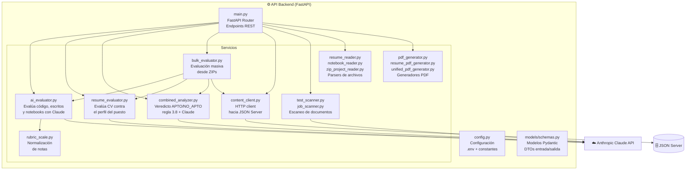

# C4 Nivel 3 — Componentes del Backend

> **¿Qué módulos Python forman el backend y cuál es la responsabilidad de cada uno?**

---

## Estructura de archivos

```
back/
├── main.py                         ← Punto de entrada FastAPI (rutas y orquestación)
├── config.py                       ← Variables de entorno y constantes globales
├── requirements.txt                ← Dependencias Python
├── .env                            ← Variables de entorno locales (NO subir a git)
├── .env.example                    ← Plantilla para crear el .env
│
├── models/
│   └── schemas.py                  ← Modelos Pydantic (DTOs de entrada y salida)
│
└── services/
    ├── ai_evaluator.py             ← Evaluación de código, escritos y notebooks con Claude
    ├── resume_evaluator.py         ← Evaluación de CVs con Claude
    ├── combined_analyzer.py        ← Análisis de aptitud combinado (CV + prueba)
    ├── bulk_evaluator.py           ← Evaluación masiva desde ZIPs
    ├── content_client.py           ← Cliente HTTP para JSON Server
    ├── test_scanner.py             ← Escanea documentos para extraer estructura de prueba
    ├── job_scanner.py              ← Escanea documentos para extraer descripción de puesto
    ├── resume_reader.py            ← Lee PDF, DOCX, TXT y extrae texto plano
    ├── notebook_reader.py          ← Lee .ipynb y separa instrucciones del código
    ├── zip_project_reader.py       ← Lee .zip y concatena archivos de código
    ├── pdf_generator.py            ← Genera PDF de evaluación técnica
    ├── resume_pdf_generator.py     ← Genera PDF de evaluación de CV
    ├── unified_pdf_generator.py    ← Genera PDF unificado (técnica + CV + aptitud)
    └── rubric_scale.py             ← Plantillas y normalización de escalas de puntuación
```

---

## Diagrama de componentes



---

## Descripción detallada de cada módulo

### `main.py` — Punto de entrada y enrutador

**Responsabilidad:** Define la aplicación FastAPI, configura CORS y declara cada endpoint. No contiene lógica de negocio; delega todo en los servicios.

**Patrón de cada endpoint:**
1. Valida la presencia de `ANTHROPIC_API_KEY`.
2. Parsea el archivo recibido (si aplica).
3. Llama al servicio correspondiente.
4. Construye el modelo de respuesta Pydantic.
5. Devuelve el resultado (JSON o `Response` con bytes PDF).

---

### `config.py` — Configuración global

```python
ANTHROPIC_API_KEY  # str  — API key de Anthropic (OBLIGATORIO)
AI_MODEL           # str  — Modelo a usar (default: "claude-sonnet-4-5")
AI_TIMEOUT         # int  — Timeout en segundos (default: 300)
MAX_RUBRIC_CRITERIA # int — Máximo de criterios en rúbrica (10)
MIN_RUBRIC_CRITERIA # int — Mínimo de criterios en rúbrica (3)
JSON_SERVER_URL    # str  — URL del JSON Server (default: "http://localhost:3000")
MIN_PASSING_CODE_SCORE # float — Nota mínima prueba (referencia, no bloquea)
MIN_PASSING_CV_SCORE   # float — Nota mínima CV (referencia, no bloquea)
```

Para cambiar el modelo de IA: edita `AI_MODEL` en `.env` o directamente en `config.py`.

---

### `models/schemas.py` — Modelos de datos (DTOs)

| Clase | Dirección | Descripción |
|-------|-----------|-------------|
| `EvaluationRequest` | Entrada | Código + ID prueba + nombre candidato |
| `EvaluationResult` | Salida | Nota, criterios, resumen, fortalezas, áreas de mejora |
| `RubricInput` | Interno | Lista de criterios + escala de puntuación |
| `RubricCriterion` | Interno | Nombre + descripción de un criterio |
| `CriterionEvaluation` | Salida | Nombre criterio + nota + comentario |
| `AIEvaluationResponse` | Interno | Respuesta cruda de la IA antes de mapear |
| `ResumeEvaluationRequest` | Entrada | Texto del CV + ID puesto + nombre candidato |
| `ResumeEvaluationResult` | Salida | Nota, resumen, fortalezas, brechas, checklist |
| `CombinedAnalyzeRequest` | Entrada | `EvaluationResult` + `ResumeEvaluationResult` |
| `CombinedAnalysisResult` | Salida | Veredicto, razonamiento, banderas rojas |
| `UnifiedReportRequest` | Entrada | Los tres resultados opcionales para generar PDF |
| `SoughtCharacteristic` | Interno | Característica buscada en el puesto |

---

### `services/ai_evaluator.py` — Evaluación técnica con IA

**Responsabilidad:** Construye el prompt y llama a Claude para evaluar:
- `evaluate_code(rubric, code, language)` → Para código fuente, ZIP o documentos de texto.
- `evaluate_written_test(document_text)` → Para evaluaciones escritas (PDF/DOCX sin rúbrica predefinidia).
- `evaluate_notebook(instructions, solution_code, cell_summary)` → Para notebooks Jupyter/Colab.

**Prompts del sistema (compact):**
- `SYSTEM_PROMPT` — Instrucciones para evaluar código.
- `SYSTEM_PROMPT_WRITTEN` — Instrucciones para evaluar texto escrito.
- `SYSTEM_PROMPT_NOTEBOOK` — Instrucciones para evaluar notebooks.

**Función `_parse_ai_response(raw)`:** Extrae el primer JSON válido de la respuesta de Claude, incluso si viene envuelto en bloques markdown. Usa `json.JSONDecoder().raw_decode()` para ser robusto ante respuestas parcialmente formateadas.

---

### `services/resume_evaluator.py` — Evaluación de CV

**Responsabilidad:** Evalúa la hoja de vida del candidato frente a la descripción del puesto.

**Función principal:** `evaluate_resume(job_description, resume_text, sought_characteristics)` → Devuelve un `dict` con todos los campos de `ResumeEvaluationResult`.

**Salida de la IA:**
```json
{
  "match_score": 4.2,
  "executive_summary": "...",
  "strengths": ["..."],
  "gaps": ["..."],
  "recommendations": ["..."],
  "overall_score_reason": "...",
  "job_requirements_checklist": [{"requirement":"...","status":"cumple","evidence":"..."}],
  "keyword_alignment": ["..."],
  "red_flags": ["..."]
}
```

---

### `services/combined_analyzer.py` — Análisis de aptitud

**Responsabilidad:** Genera el veredicto final `apto` / `no_apto` combinando los resultados técnicos y del CV.

**Lógica de aprobación automática:**
```python
_APPROVAL_THRESHOLD = 3.8

def _average_above_threshold(code_result, resume_result) -> bool:
    promedio = ((code_result.overall_score or 0) + (resume_result.match_score or 0)) / 2
    return promedio > _APPROVAL_THRESHOLD
```
Si el promedio supera 3.8, el veredicto se fuerza a `"apto"` **sin llamar a la IA**.

Solo si el promedio no supera el umbral se llama a Claude para un análisis detallado.

---

### `services/bulk_evaluator.py` — Evaluación masiva

**Responsabilidad:** Procesa ZIPs con múltiples archivos de candidatos.

**Convención de nombres de archivo:**
- CVs: `nombre-apellido-cv.ext` (ej. `juan-perez-cv.pdf`)
- Pruebas: `nombre-apellido-prueba.ext` (ej. `juan-perez-prueba.zip`)

**Funciones principales:**
| Función | Descripción |
|---------|-------------|
| `process_bulk_cv_zip(zip_bytes, job_id)` | Extrae archivos `-cv.*`, evalúa cada uno y devuelve lista de resultados |
| `process_bulk_test_zip(zip_bytes, technical_test_id)` | Extrae archivos `-prueba.*`, detecta tipo y evalúa cada uno |
| `process_bulk_combined(cv_results, test_results)` | Cruza resultados por `nombre-apellido` y ejecuta el análisis de aptitud |

**Detección automática de tipo de prueba:**
- `.ipynb` → notebook
- `.zip` → proyecto multi-archivo
- `.pdf`, `.docx`, `.doc`, `.txt` → evaluación escrita
- Resto → código fuente

---

### `services/content_client.py` — Cliente de JSON Server

**Responsabilidad:** Única capa de acceso al JSON Server. Abstrae las llamadas HTTP.

| Función | Descripción |
|---------|-------------|
| `get_job(job_id)` | Obtiene un puesto por ID |
| `get_technical_test(test_id)` | Obtiene una prueba técnica por ID |
| `get_rubric_for_technical_test(test_id)` | Extrae y valida la rúbrica de una prueba |
| `get_sought_characteristics(job_id)` | Lista las características buscadas del puesto |
| `build_job_description_text(job)` | Construye el texto de descripción para el prompt |

---

### Parsers de archivos

| Módulo | Tipos soportados | Función principal |
|--------|-----------------|-------------------|
| `resume_reader.py` | `.pdf`, `.docx`, `.doc`, `.txt` | `read_resume_bytes(filename, content)` |
| `notebook_reader.py` | `.ipynb` | `read_notebook_bytes(filename, content)` → `NotebookContent(instructions, solution_code, cell_summary)` |
| `zip_project_reader.py` | `.zip` | `read_zip_project(content)` → `ZipProjectResult(bundled_code, project_tree, included_files, skipped_files)` |

**`resume_reader.py` — cómo extrae texto:**
- **PDF** → `pypdf.PdfReader`
- **DOCX** → `python-docx` (`.Document`)
- **DOC** → intenta decodificar como UTF-8; lanza error si es binario puro
- **TXT** → decode UTF-8

**`notebook_reader.py` — cómo separa el notebook:**
- Celdas `markdown` → `instructions` (enunciados, explicaciones)
- Celdas `code` → `solution_code` (código de solución del candidato)

---

### Scanners (admin)

| Módulo | Función | Descripción |
|--------|---------|-------------|
| `test_scanner.py` | `scan_test_document(text)` → `ScannedTest` | Claude extrae: `title`, `brief`, `defaultLanguage`, `criteria[]` |
| `job_scanner.py` | `scan_job_document(text)` → `ScannedJob` | Claude extrae: `title`, `description`, `soughtCharacteristics[]` |

Ambos usan el mismo patrón de parsing robusto de JSON.

---

### Generadores PDF

| Módulo | Función | Genera |
|--------|---------|--------|
| `pdf_generator.py` | `generate_evaluation_pdf(result)` | PDF de evaluación técnica |
| `resume_pdf_generator.py` | `generate_resume_pdf(result)` | PDF de evaluación de CV |
| `unified_pdf_generator.py` | `generate_unified_pdf(code_result, resume_result, combined_result)` | PDF unificado con los tres resultados |

Todos usan **ReportLab** y devuelven `bytes`.

---

### `rubric_scale.py` — Escalas de puntuación

**Función:** `suggest_score_scale(default_language, title, brief)` → Devuelve un `dict` con la escala 0-5 adaptada al tipo de prueba (desarrollo, análisis de datos, diseño, etc.).

**Función:** `normalize_evaluation_score(score)` → Asegura que la nota esté entre 0 y 5 con precisión de 1 decimal.
