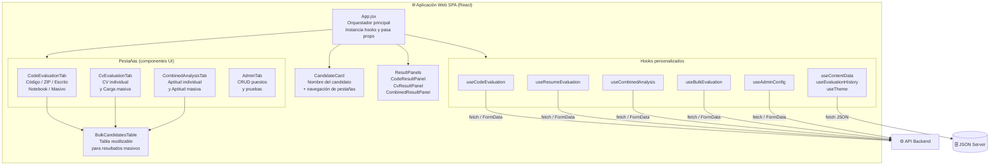

# C4 Nivel 3 — Componentes del Frontend

> **¿Qué archivos React/JS forman la SPA y cuál es la responsabilidad de cada uno?**

---

## Estructura de archivos

```
front/src/
├── main.jsx                        ← Monta <App /> en el DOM
├── App.jsx                         ← Orquestador principal: state global, pestañas
├── App.css                         ← Estilos globales (temas claro/oscuro)
├── index.css                       ← Reset CSS base
├── constants.js                    ← URLs y constantes de configuración
├── scoreScaleTemplates.js          ← Plantillas de escala de puntuación para el admin
│
├── hooks/                          ← Lógica de negocio extraída en hooks personalizados
│   ├── useTheme.js                 ← Tema claro/oscuro con persistencia en localStorage
│   ├── useContentData.js           ← Carga puestos y pruebas desde JSON Server
│   ├── useEvaluationHistory.js     ← Historial de candidatos evaluados en sesión
│   ├── useCodeEvaluation.js        ← Estado y lógica de evaluación técnica individual
│   ├── useResumeEvaluation.js      ← Estado y lógica de evaluación de CV individual
│   ├── useCombinedAnalysis.js      ← Estado y lógica de análisis de aptitud individual
│   ├── useAdminConfig.js           ← Estado y lógica del panel de administración
│   └── useBulkEvaluation.js        ← Estado y lógica de evaluación masiva (CVs + pruebas)
│
├── components/
│   ├── CandidateCard.jsx           ← Nombre del candidato + selector de pestañas
│   ├── CodeEvaluationTab.jsx       ← Pestaña "Evaluación Técnica"
│   ├── CvEvaluationTab.jsx         ← Pestaña "Evaluación de CV"
│   ├── CombinedAnalysisTab.jsx     ← Pestaña "Análisis de Aptitud" (individual + masivo)
│   │
│   ├── admin/
│   │   └── AdminTab.jsx            ← Pestaña "Administración" (puestos y pruebas)
│   │
│   ├── results/
│   │   ├── CodeResultPanel.jsx     ← Panel derecho: resultado de evaluación técnica
│   │   ├── CvResultPanel.jsx       ← Panel derecho: resultado de evaluación de CV
│   │   └── CombinedResultPanel.jsx ← Panel derecho: resultado del análisis de aptitud
│   │
│   └── common/
│       ├── AppHeader.jsx           ← Encabezado con logo, tema y botón reset
│       ├── LoadingScreen.jsx       ← Pantalla de carga inicial
│       ├── ErrorScreen.jsx         ← Pantalla de error de conexión
│       └── BulkCandidatesTable.jsx ← Tabla reutilizable de resultados masivos
│
└── utils/
    ├── format.js                   ← Formateo de notas (formatScore)
    ├── csv.js                      ← Exportar historial a CSV
    ├── download.js                 ← Descarga de blobs (PDFs)
    ├── files.js                    ← Helpers de lectura de archivos
    └── adminHelpers.js             ← Helpers del panel de administración
```

---

## Diagrama de componentes



---

## Descripción detallada

### `App.jsx` — Orquestador principal

**Responsabilidad:** Es el componente raíz. No tiene lógica de negocio directa; instancia todos los hooks y distribuye estado y handlers a los componentes hijos vía props.

**Hooks que instancia:**
| Hook | Propósito |
|------|-----------|
| `useTheme` | Tema claro/oscuro |
| `useContentData` | Carga puestos y pruebas al iniciar |
| `useEvaluationHistory` | Historial de sesión |
| `useCodeEvaluation` | Estado de evaluación técnica individual |
| `useResumeEvaluation` | Estado de evaluación de CV individual |
| `useCombinedAnalysis` | Estado de análisis de aptitud individual |
| `useAdminConfig` | Estado del panel admin |
| `useBulkEvaluation` | Estado de evaluación masiva |

**Gestión de la pestaña activa:** `activeTab` puede ser `'code'`, `'cv'`, `'combined'` o `'admin'`.

---

### `constants.js` — Constantes de configuración

```js
export const API_BASE = 'http://localhost:8000'
export const JSON_SERVER_BASE = 'http://localhost:3000'

// Tipos de archivo aceptados por cada input
export const CODE_FILE_ACCEPT = '.py,.js,.ts,.java,.c,.cpp,.cs,.go,.rb,.php,.txt,.kt,.swift'
export const ZIP_FILE_ACCEPT = '.zip'
export const DOC_FILE_ACCEPT = '.pdf,.docx,.doc,.txt'
export const NOTEBOOK_FILE_ACCEPT = '.ipynb'
export const RESUME_FILE_ACCEPT = '.pdf,.docx,.doc,.txt'
export const JOB_DOC_ACCEPT = '.pdf,.docx,.doc,.txt'
```

> **Para cambiar la URL del backend:** edita `API_BASE` en este archivo.

---

### Hooks personalizados

#### `useCodeEvaluation.js`

Gestiona todo lo relacionado con la evaluación técnica individual.

**Estado expuesto:**
```
codeEvalSubTab     — 'code' | 'zip' | 'written' | 'notebook'
selectedTechnicalTestId
language
uploadedFile       — archivo de código individual
zipUpload          — archivo .zip del proyecto
code               — código pegado en textarea
documentFile       — archivo para evaluación escrita
notebookFile       — archivo .ipynb
result             — EvaluationResult (respuesta del backend)
error              — mensaje de error
loading            — booleano de carga
```

**Handlers expuestos:**
- `evaluate()` — llama a `POST /api/evaluate/upload`
- `evaluateWritten()` — llama a `POST /api/evaluate/written`
- `evaluateNotebook()` — llama a `POST /api/evaluate/notebook`
- `handleDownloadPdf()` — llama a `POST /api/generate-pdf` y descarga el blob
- `reset()` — limpia todo el estado

---

#### `useResumeEvaluation.js`

Gestiona la evaluación de CV individual.

**Estado expuesto:**
```
selectedJobId      — ID del puesto seleccionado
resumeFile         — archivo del CV
resumeResult       — ResumeEvaluationResult
resumeError
resumeLoading
```

**Handlers expuestos:**
- `evaluateResume()` — llama a `POST /api/resume/evaluate/upload`
- `downloadResumePdf()` — llama a `POST /api/resume/generate-pdf`
- `reset()`

---

#### `useCombinedAnalysis.js`

Gestiona el análisis de aptitud individual.

**Estado expuesto:**
```
combinedResult     — CombinedAnalysisResult
combinedLoading
```

**Handlers expuestos:**
- `generateCombinedAnalysis()` — llama a `POST /api/combined/analyze`
- `downloadUnifiedPdf()` — llama a `POST /api/report/generate-pdf`
- `reset()`

---

#### `useBulkEvaluation.js`

Gestiona toda la lógica de carga masiva.

**Estado expuesto (por sección):**

| Sección | Estado | Descripción |
|---------|--------|-------------|
| CVs masivos | `bulkCvZip`, `bulkCvJobId`, `bulkCvLoading`, `bulkCvResults`, `bulkCvError` | ZIP con CVs |
| Pruebas masivas | `bulkTestZip`, `bulkTestId`, `bulkTestLoading`, `bulkTestResults`, `bulkTestError` | ZIP con pruebas |
| Aptitud masiva | `bulkCombinedLoading`, `bulkCombinedResults`, `bulkCombinedError` | Cruce nombre→nombre |

**Handlers expuestos:**
- `evaluateBulkCv()` — llama a `POST /api/evaluate/bulk-cv`
- `evaluateBulkTest()` — llama a `POST /api/evaluate/bulk-test`
- `analyzeBulkCombined()` — llama a `POST /api/analyze/bulk-combined`
- `reset()` — limpia todos los estados masivos

---

#### `useAdminConfig.js`

Gestiona el panel de administración (puestos y pruebas técnicas).

**Funciones clave:**
- `scanTestFile(file)` — sube PDF/DOCX a `POST /api/admin/scan-test-file` y pre-rellena el formulario de nueva prueba; guarda automáticamente en JSON Server.
- `scanJobFile(file)` — sube PDF/DOCX a `POST /api/admin/scan-job-file` y pre-rellena el formulario de nuevo puesto; guarda automáticamente en JSON Server.
- `acceptSaveTest()` — guarda / actualiza la prueba en JSON Server.
- `acceptSaveJob()` — guarda / actualiza el puesto en JSON Server.

---

#### `useContentData.js`

Carga los datos maestros al arrancar la app.

```js
// Llama en paralelo:
GET http://localhost:3000/jobs
GET http://localhost:3000/technicalTests
```

---

### Componentes de pestaña

#### `CodeEvaluationTab.jsx` — Evaluación Técnica

**Sub-pestañas:**
| Sub-pestaña | Tipo de entrega | Endpoint backend |
|------------|----------------|-----------------|
| Código fuente | `.py`, `.js`, `.java`, etc. o texto | `POST /api/evaluate/upload` |
| Proyecto ZIP | `.zip` con múltiples archivos | `POST /api/evaluate/upload` |
| Evaluación escrita | `.pdf`, `.docx`, `.txt` | `POST /api/evaluate/written` |
| Notebook | `.ipynb` | `POST /api/evaluate/notebook` |
| Carga masiva | `.zip` con archivos `nombre-apellido-prueba.*` | `POST /api/evaluate/bulk-test` |

---

#### `CvEvaluationTab.jsx` — Evaluación de CV

**Sub-pestañas:**
| Sub-pestaña | Descripción |
|------------|-------------|
| Individual | Sube un CV (`pdf/docx/txt`), selecciona puesto y evalúa |
| Carga masiva | ZIP con archivos `nombre-apellido-cv.*` |

---

#### `CombinedAnalysisTab.jsx` — Análisis de Aptitud

**Sub-pestañas:**
| Sub-pestaña | Descripción |
|------------|-------------|
| Individual | Requiere resultado técnico + CV en memoria; genera veredicto y descarga PDF |
| Carga masiva | Usa resultados de las cargas masivas anteriores; cruza por `nombre-apellido` |

Ambas sub-pestañas muestran un **badge numérico** cuando hay resultados acumulados.

---

#### `AdminTab.jsx` — Administración

**Sub-pestañas:**
| Sub-pestaña | Descripción |
|------------|-------------|
| Pruebas técnicas | CRUD de pruebas; importación desde PDF/DOCX |
| Puestos de trabajo | CRUD de puestos; importación desde PDF/DOCX |

---

### `BulkCandidatesTable.jsx` — Tabla reutilizable

Componente compartido entre las tres pestañas para mostrar resultados masivos.

**Prop `type`:** `'cv'` | `'test'` | `'combined'`

**Columnas según tipo:**

| Columna | cv | test | combined |
|---------|----|----- |----------|
| Candidato | ✓ | ✓ | ✓ |
| Nota CV | ✓ | — | ✓ |
| Nota prueba | — | ✓ | ✓ |
| Promedio | — | — | ✓ |
| Veredicto | — | — | ✓ |
| Error | ✓ | ✓ | ✓ |
| Fila expandible | ✓ (detalle CV) | ✓ (detalle prueba) | ✓ (detalle combinado) |

---

### Paneles de resultado (columna derecha)

| Componente | Muestra |
|-----------|---------|
| `CodeResultPanel` | Nota general, criterios con barras, resumen ejecutivo, fortalezas, áreas de mejora, árbol de archivos (si es ZIP) |
| `CvResultPanel` | Nota de ajuste, checklist de requisitos, resumen, fortalezas, brechas, alertas |
| `CombinedResultPanel` | Veredicto (APTO/NO APTO) con color, razonamiento detallado, banderas rojas |

---

### `utils/`

| Archivo | Función principal | Uso |
|---------|------------------|-----|
| `format.js` | `formatScore(n)` | Formatea notas a 1 decimal |
| `csv.js` | `downloadCandidatesTableCsv(history)` | Exporta historial como CSV |
| `download.js` | `downloadBlob(bytes, filename)` | Descarga un blob como archivo |
| `files.js` | `readFileAsText(file)` | Lee un File a string (Promise) |
| `adminHelpers.js` | Helpers de formularios del admin | Lógica de draft y validación |
