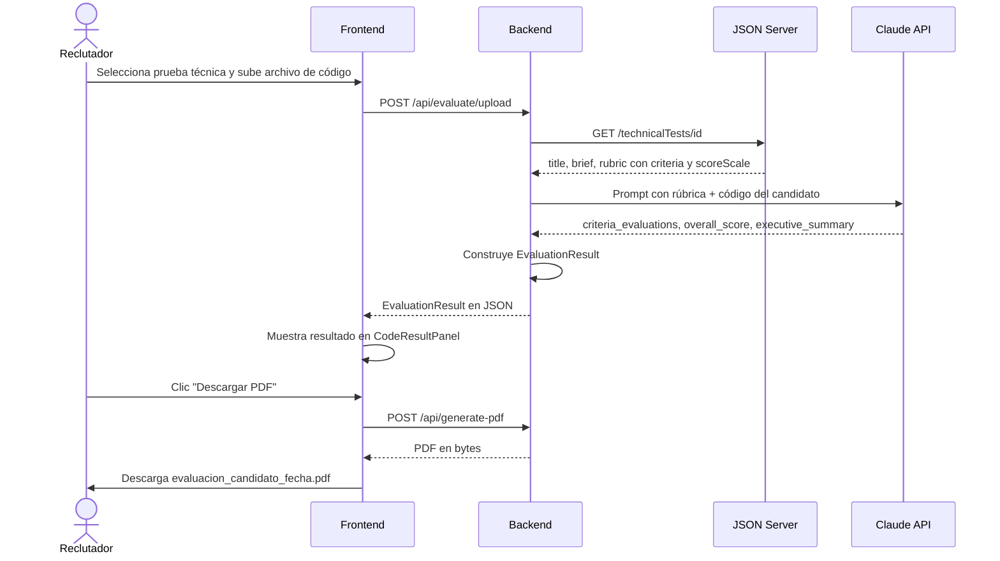
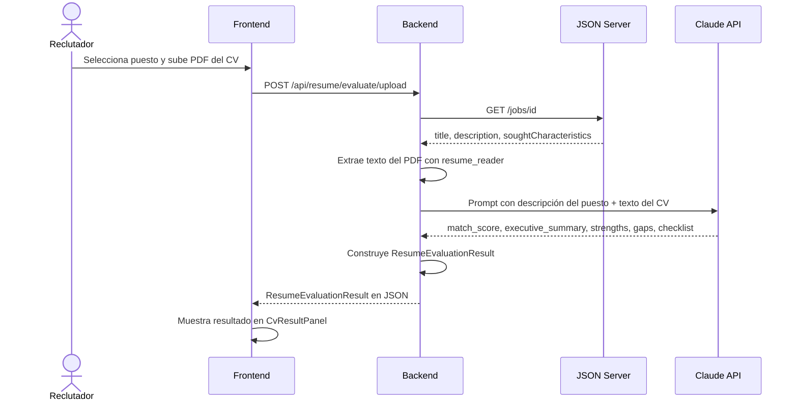
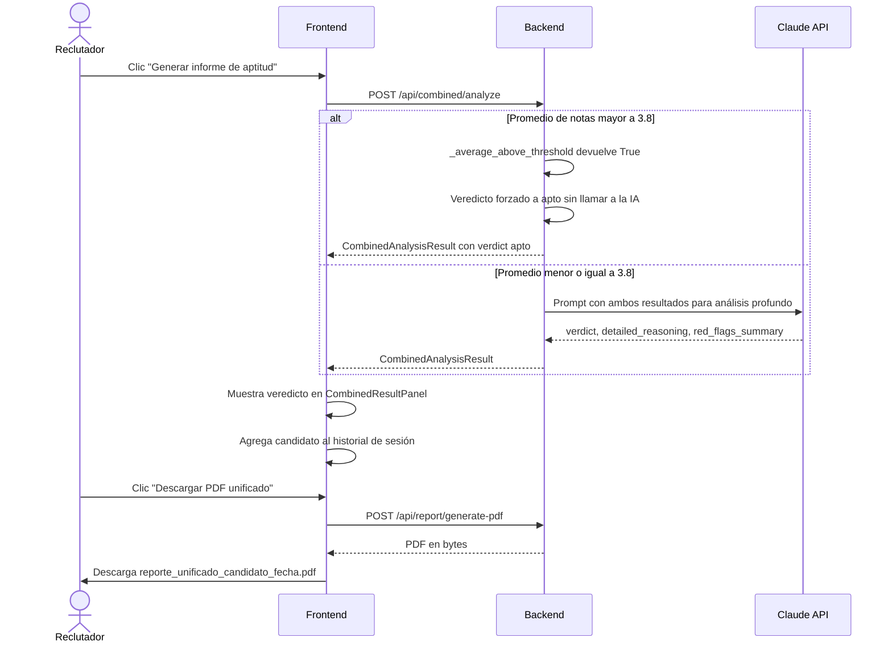
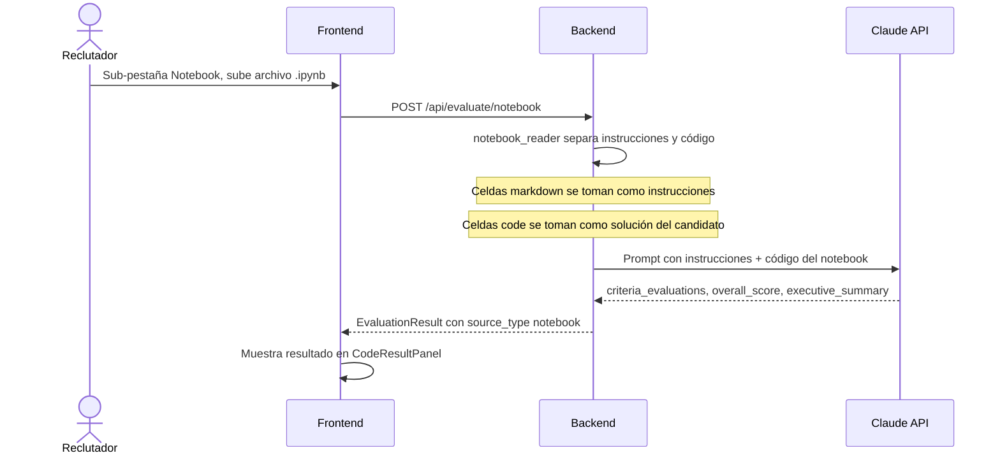
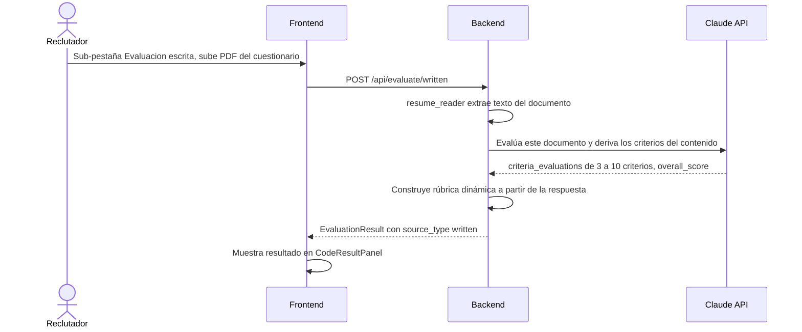
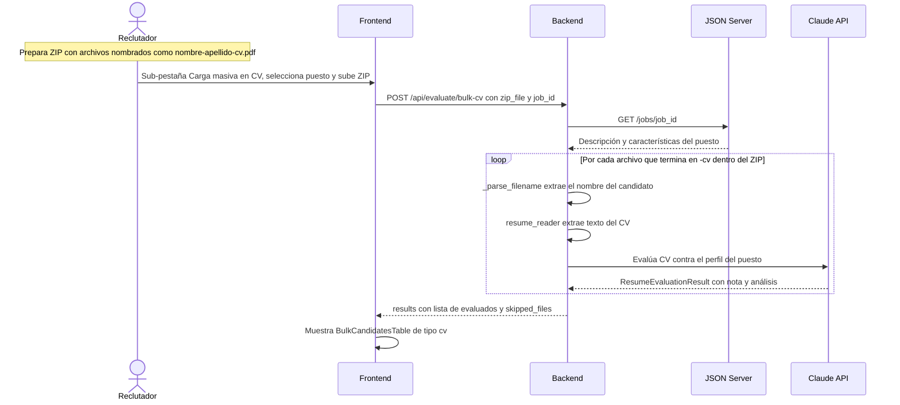
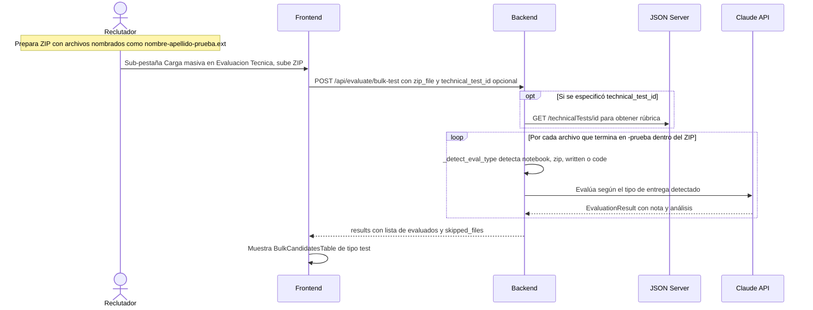
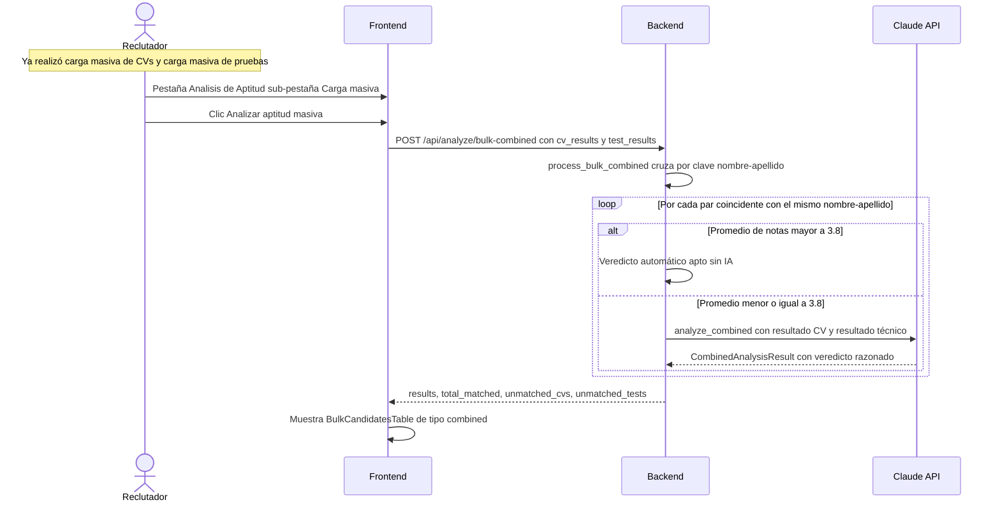
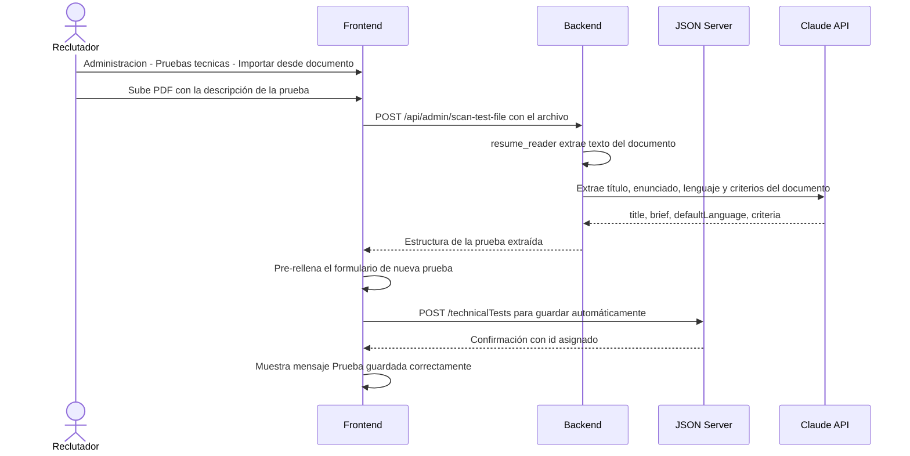
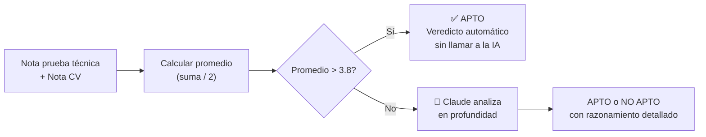

# Flujos principales del sistema

> Diagramas de secuencia que muestran cómo interactúan los actores y componentes en cada caso de uso.

---

## Flujo 1 — Evaluación técnica individual (código fuente)

---

## Flujo 2 — Evaluación de CV individual

---

## Flujo 3 — Análisis de aptitud individual

> **Prerrequisito:** Ya existe un resultado de prueba técnica y un resultado de CV en memoria del navegador.

---

## Flujo 4 — Evaluación de notebook Jupyter/Colab

---

## Flujo 5 — Evaluación escrita (PDF/DOCX sin rúbrica predefinida)

---

## Flujo 6 — Carga masiva de CVs

---

## Flujo 7 — Carga masiva de pruebas técnicas

---

## Flujo 8 — Análisis masivo de aptitud (cruce por nombre)

---

## Flujo 9 — Importar prueba técnica desde documento (Admin)

---

## Regla de aprobación automática

Esta regla aplica tanto al análisis **individual** (`combined_analyzer.py`) como al **masivo** (`bulk_evaluator.py`).
